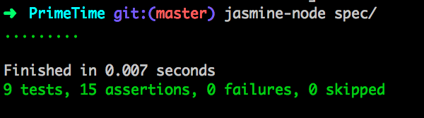
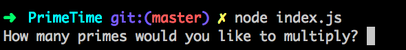
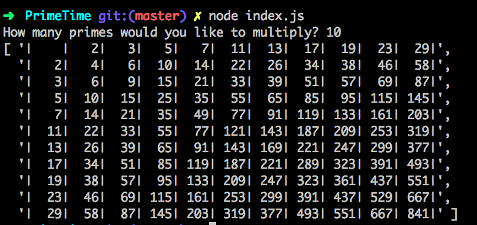
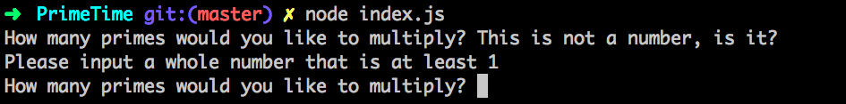

# PrimeTime

Do you struggle with your times tables? Do you find it difficult to determine
whether a number is prime or not? Well this app is the solution for you.
Simply input a number, and it'll bring back that many primes and return a handy, little
multiplication table for you. The days of struggling with Maths will be a thing
of the past!

## The Task

- The user should input a whole number N, where is N is at least 1.
- The application should calculate the first N prime numbers.
- The application should output a multiplication table of these prime numbers.

## How to Run

First things first, lets get this app on your computer and set it up.
To do this, type the following commands into your terminal:

```
$ git clone git@github.com:jackbittiner/PrimeTime.git
$ cd PrimeTime
```

Make sure you have node installed on your computer and then run the following
command to get set up:

```
$ npm install
```

We're good to go!

#### Tests

This application was test-driven. To run the tests type the following into
the terminal:

```
$ jasmine-node spec
```

You should see the following:



(ALL IN THE GREEN! What a beautiful sight!)

#### The App

To start the application, type the following in the command line.

```
$ node index.js
```

You will then be prompted with a message asking you for an input like so:



Then enter a whole number that is greater than or equal to 1 and press return.
You should see the following results:



If you input a wrong value you will be prompted for input again like so:



Voila! That is the app! Have a little play around and brush up on your times
tables!

## My Solution

So how did I get about to solving this problem? Well I broke down the problem
to its simplest constituent parts. This is what each part does and how:

__PrimeGenerator__: This constructor is responsible for two things. One is to
determine whether a number is prime or not. The other is to generate the first
N primes where N is given as an argument. To determine whether a number is prime or not
it looks at all the primes that came before it. So say we were evaluating the number 11,
the primes before it are 2, 3, 5 and 7. And because 11 isn't divisible by any of those
numbers, 11 has to be prime. So if we take the number 10, that is perfectly divisible
by 2 so will be deemed not prime. To generate N primes, the getPrimes method increments
from 2 and checks each number using the method described before. It stops when it
reaches N primes.

__MultiplicationTable__: This constructor is responsible for creating the
multiplication table. It takes in an array of numbers, and forms a two-dimensional
array of each number multiplied with itself and every other number in the array.
It then also inserts the original numbers at the beginning of the array.

__TableGenerator__: This constructor is essentially the display of the final results
of the app. It takes in a two-dimensional array and formats it in a way that it is
readable in the console.

__InputValidator__: This constructor checks the user input to determine whether it
is valid. It will return false if the input is not a whole number and true if it is
a whole number.

__Index__: This is where the magic happens. The app will prompt the user for a
number and then return the results in table form. If the user inputs an invalid
input, it will prompt again until a whole number above 1 is stated.
