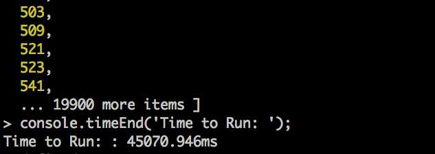

# PrimeTime

Do you struggle with your times tables? Do you find it difficult to determine
whether a number is prime or not? Well this app is the solution for you.
Simply input a number, and it'll bring back that many primes and return a handy, little
multiplication table for you. The days of struggling with Maths will be a thing
of the past!

## The Task

- The user should input a whole number N, where is N is at least 1.
- The application should calculate the first N prime numbers.
- The application should output a multiplication table of these prime numbers.

## How to Run

First things first, lets get this app on your computer and set it up.
To do this, type the following commands into your terminal:

```
$ git clone git@github.com:jackbittiner/PrimeTime.git
$ cd PrimeTime
```

Make sure you have node installed on your computer and then run the following
command to get set up:

```
$ npm install
```

We're good to go!

#### Tests

This application was test-driven. To run the tests type the following into
the terminal:

```
$ jasmine-node spec
```

You should see the following:


(ALL IN THE GREEN! What a beautiful sight!)

#### The App

To start the application, type the following in the command line.

```
$ node index.js
```

You will then be prompted with a message asking you for an input like so:


Then enter a whole number that is greater than or equal to 1 and press return.
You should see the following results:


If you input a wrong value you will be prompted for input again like so:


Voila! That is the app! Have a little play around and brush up on your times
tables!

## My Solution

So how did I get about to solving this problem? Well I broke down the problem
to its simplest constituent parts. This is what each part does and how:

__PrimeGenerator__: This constructor is responsible for two things. One is to
determine whether a number is prime or not. The other is to generate the first
N primes where N is given as an argument. To determine whether a number is prime or not
the function first checks if the argument is perfectly divisible by 2 or 3. If this
is true and the argument isn't 2 or 3, then it returns false. If the number is 2 or 3,
it will return true. Then we check if the numbers from 5 upwards are prime or not. We
begin with a variable of 5 and increment it by 6 each time until we get to the square root
of the argument. If the argument is perfectly divisible by the variable or the variable + 2,
then it isn't prime. This is why we can increment the variable by 6 as each number between 5
and 11 will be checked either from the original if statement, or by this new if statement.
This speeds up the process of checking if a number is prime.

Then to generate N primes, the getPrimes method increments
from 2 and checks each number using the method described before. It stops when it
reaches N primes.

__MultiplicationTable__: This constructor is responsible for creating the
multiplication table. It takes in an array of numbers, and forms a two-dimensional
array of each number multiplied with itself and every other number in the array.
It then also inserts the original numbers at the beginning of the array.

__TableGenerator__: This constructor is essentially the display of the final results
of the app. It takes in a two-dimensional array and formats it in a way that it is
readable in the console.

__InputValidator__: This constructor checks the user input to determine whether it
is valid. It will return false if the input is not a whole number and true if it is
a whole number.

__Index__: This is where the magic happens. The app will prompt the user for a
number and then return the results in table form. If the user inputs an invalid
input, it will prompt again until a whole number above 1 is stated.

## Optimisation

Generating prime numbers can be slow. Especially a lot of them. In my first solution
for this challenge this was a problem for me. This was my original function:


It would judge whether a number was prime or not based on the primes that
came before it. This was slow. Lets say someone wants the first 20,000 primes,
in order to deduce whether the 20000th prime was in fact prime, it would have
to check it against 19,999 other numbers. We can see just how slow it is
here:



45 seconds of thumb twiddling is the time to beat!

As soon as I refactored my isPrime method to the one I have in my codebase now,
this is the result:


WOW! 0.035 seconds! It's a new personal best!

## Reflection

#### What I Am Pleased With

- It works!
- It was test-driven.
- I separated the concerns to the different constructors so each is responsible
for one thing.
- I'm quite pleased with the formatting of the table (it took me longer than it
should!)

#### What Would I Do Next With More Time?

- A bit of a clean up. I have some monster methods in my code that I'm sure could
be broken down a bit more. Especially the formatting of the table!
- I would ideally like to make a front-end to display the results. The terminal is
only so big and therefore the display gets unpleasant when large numbers are entered.
If it was displayed on a webpage, the table can keep on growing both sideways and
downwards.
- I feel my index.js file that prompts the user for input is a bit hideous. But hey ho,
it does the trick.

## Thank You

Thanks for taking the time to evaluate this tech-test. I hope it's up to scratch!
